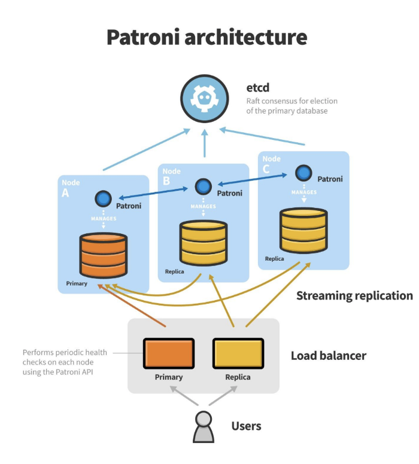

# follows
https://www.linode.com/docs/databases/postgresql/create-a-highly-available-postgresql-cluster-using-patroni-and-haproxy/#before-you-begin

# Servers

**Note**: add these to `/etc/hosts`

```
192.168.1.200 pg-mt
192.168.1.201 pg-sl1
```

# vms
```
VBoxManage startvm cent7_pg1 --type headless
VBoxManage startvm cent7_pg2 --type headless
```

# architectures



# softwares

```
pg-mt
    postgres (master)
    patroni
    etcd

pg-mt
    postgres (slave)
    patroni
    haproxy
```

# install 

## prepare

```
ssh key-less to all sv
    user: admin
        sudo no password
test
    ssh admin@pg-mg
    ssh admin@pg-slv
```

# postgres

    [all-server]
    # Install the repository RPM:
    yum install https://download.postgresql.org/pub/repos/yum/reporpms/EL-7-x86_64/pgdg-redhat-repo-latest.noarch.rpm

    # Install PostgreSQL:
    yum install postgresql12-server

    # Optionally initialize the database and enable automatic start:
    /usr/pgsql-12/bin/postgresql-12-setup initdb
    systemctl enable postgresql-12
    systemctl start postgresql-12 # no, stop it

    sudo su postgres
    echo "export PATH=\$PATH:/usr/pgsql-12/bin" >> ~/.bashrc


## python
    
    [all-server]
    # python 2.7+; pip
    yum install epel-release
    yum install python-pip python-devel gcc

    sudo pip install --upgrade pip
    sudo pip install --upgrade setuptools
    sudo pip install wheel
    sudo pip install psycopg2-binary 
    sudo pip install patroni[etcd]

    [admin]
    pip install --user patroni[etcd]

## etcd

    [pg-mt]
    yum install etcd

    config:
    append to: /etc/etcd/etcd.conf

```
ETCD_LISTEN_PEER_URLS="http://192.168.1.200:2380"
ETCD_LISTEN_CLIENT_URLS="http://localhost:2379,http://192.168.1.200:2379"
ETCD_INITIAL_ADVERTISE_PEER_URLS="http://192.168.1.200:2380"
ETCD_INITIAL_CLUSTER="etcd0=http://192.168.1.200:2380,"
ETCD_ADVERTISE_CLIENT_URLS="http://192.168.1.200:2379"
ETCD_INITIAL_CLUSTER_TOKEN="cluster-pg"
ETCD_INITIAL_CLUSTER_STATE="new"
```
    sudo systemctl restart etcd

# configure

## Patroni

**NOTE**: change the IPs for the servers

    [all-server]
    sudo rm -rf /data 
    sudo mkdir /data/patroni -p
    sudo chown -R postgres:postgres /data/
    sudo chmod 700 /data/patroni

    [pg-mt]
    create file `/var/lib/pgsql/patroni/patroni.yml`, using template `pg-mt.yml`
    
    start:
        systemctl start postgresql-12 # let patroni handle it
        patroni /var/lib/pgsql/patroni/patroni.yml

    [pg-sl1]
    create file `/var/lib/pgsql/patroni/patroni.yml`, using template `pg-sl1.yml`

    start:
        sudo systemctl stop postgresql-12 # let patroni handle it
        patroni /var/lib/pgsql/patroni/patroni.yml

    [all-server]
    sudo mkdir /data/patroni -p
    sudo chown postgres:postgres /data/patroni
    sudo chmod 700 /data/patroni

```
patroni cannot run as root, so...
[all-server]
    create systemd script
    at /etc/systemd/system/patroni.service
    using template `patroni.service`
```

# HAProxy

```
[pg-sl1]
    sudo apt install haproxy -y
    copy template config from haproxy/haproxy.cfg to /etc/haproxy/haproxy.cfg
    restat:
        systemctl restart haproxy
    if run fail, set this 
        setsebool -P haproxy_connect_any=1
    check:
        systemctl status haproxy

        goto http://pg-sl1:7000/
```


Now you can connect to server at

Try to kill master, it would looks like:


```
Test
    patronictl -c /var/lib/pgsql/patroni/patroni-sl1.yml list

kill master
+ Cluster: postgres (6852358865010067701) --------+----+-----------+
|    Member    |      Host     |  Role  |  State  | TL | Lag in MB |
+--------------+---------------+--------+---------+----+-----------+
| postgres-sl1 | 192.168.1.201 | Leader | running |  2 |           |
+--------------+---------------+--------+---------+----+-----------+

after turn on master again
+ Cluster: postgres (6852358865010067701) --------+----+-----------+
|    Member    |      Host     |  Role  |  State  | TL | Lag in MB |
+--------------+---------------+--------+---------+----+-----------+
| postgres-mt  | 192.168.1.200 |        | running |  2 |       0.0 |
| postgres-sl1 | 192.168.1.201 | Leader | running |  2 |           |
+--------------+---------------+--------+---------+----+-----------+
```

# Check

```
patronictl -c /var/lib/pgsql/patroni/patroni-sl1.yml list
```

create some db, done, etc


@vietvudanh, 2020